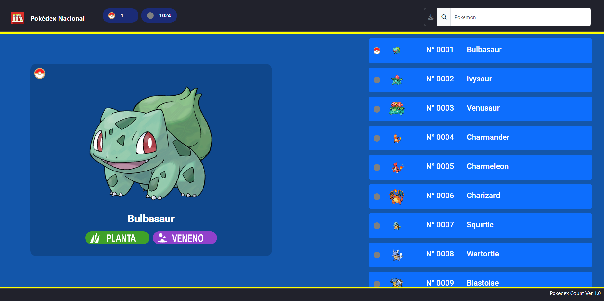

<h1 align="center">Pokedex</h1>

<p align="center">
    <a href="CHANGELOG.md">
        
    </a>
    <a href="https://github.com/DiferreiDev/Pokedex-JS">
        
    </a>

</p>

<p align="center">  
Esta es un pokedex simple desarrolada en HTML, JS y CSS. Funciona a partir de un json que generas a traves de la PokeApi y muestra todos los pokemon y muestra sus diferentes formas.
</p>
<p align="center">
    <a href="https://diferreidev.github.io/Pokedex-JS/">
        Live Demo
    </a>
</p>



## 🚀 Instrucciones

Necesitas levantar un servidor, puedes hacerlo localmente con python:

> [!NOTE]
> Necesitas tener instalado Python 3

```bash
python -m http.server [PORT]
```

Puedes acceder via web por Localhost (127.0.0.1)

<hr>
Primero necesitas acceder al generate_json.html para descargar los archivos JSON base en caso de ser necesarios o si existen nuevos pokemon posterior a la publicacion de esta version del proyecto, esos archivos los moveras a assets/json.   Estos archivos contienen información de los pokemons obtenidas a traves de la PokeApi.

#### Pokedex.js

```json
{
  "entry_number": 1,
  "name": "Bulbasaur",
  "sprite": "https://raw.githubusercontent.com/PokeAPI/sprites/master/sprites/pokemon/1.png",
  "art_default": "https://raw.githubusercontent.com/PokeAPI/sprites/master/sprites/pokemon/other/official-artwork/1.png",
  "gender_differences": false,
  "forms": [
    {
      "id": "1",
      "name": "Bulbasaur ",
      "art": "https://raw.githubusercontent.com/PokeAPI/sprites/master/sprites/pokemon/other/official-artwork/1.png",
      "sprite": "https://raw.githubusercontent.com/PokeAPI/sprites/master/sprites/pokemon/1.png",
      "types": ["Planta", "Veneno"]
    }
  ]
}
```

#### Pokedex_view.js

```json
{ "entry_number": 1, "view": false },
```

Una vez estos archivos esten en el proyecto pueden acceder al index.html y explorar.

- Puedes filtrar por region desde el titulo de la pokedex o filtrando por el nombre.
- Puedes visualizar un pokemon seleccionandolo en la lista y se generara el arte oficial extraida desde la PokeApi, en caso de no tener el arte oficial registrado se mostrara la imagen del pokemon HOME.
- Puedes marcarlo como capturado o liberarlo presionando en el circulo de esquina superior de la imagen del pokemon.
- Puedes generar el Pokedex_view.json actualizado para descargarlo y utilizarlo la proxima vez que inicialices el proyecto.

## 📘 Recursos

- [PokeApi](https://pokeapi.co)
- [Bootstrap](https://getbootstrap.com)
- [Fontaweasome](https://fontawesome.com)

## 🔑 Licencia

Distribuido bajo la Licencia MIT. Mira LICENSE para mas información.
